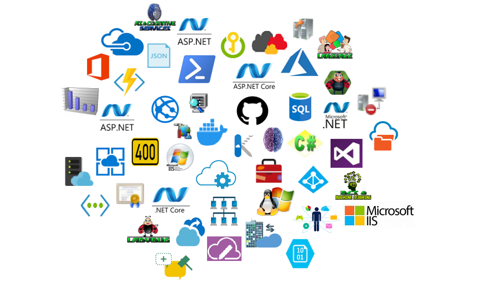
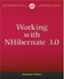
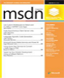
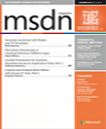

A place where all my articles will live, let's see how it works and where it goes.

+ [Here](msdn/) you will find my original MSDN articles
+ [Here](csharp/) you will find my C# articles and trainings
+ [Here](waws/) you will find my original MSDN articles I wrote for WAWS (Windows Azure Web Sites ***aka*** Azure App Services)
+ [Here](azure/) you will find the new Azure related articles I write 
+ [Here](https://github.com/benperk/benperk.github.io) you will find all these articles on GitHub

I have written the following books and articles.

        
